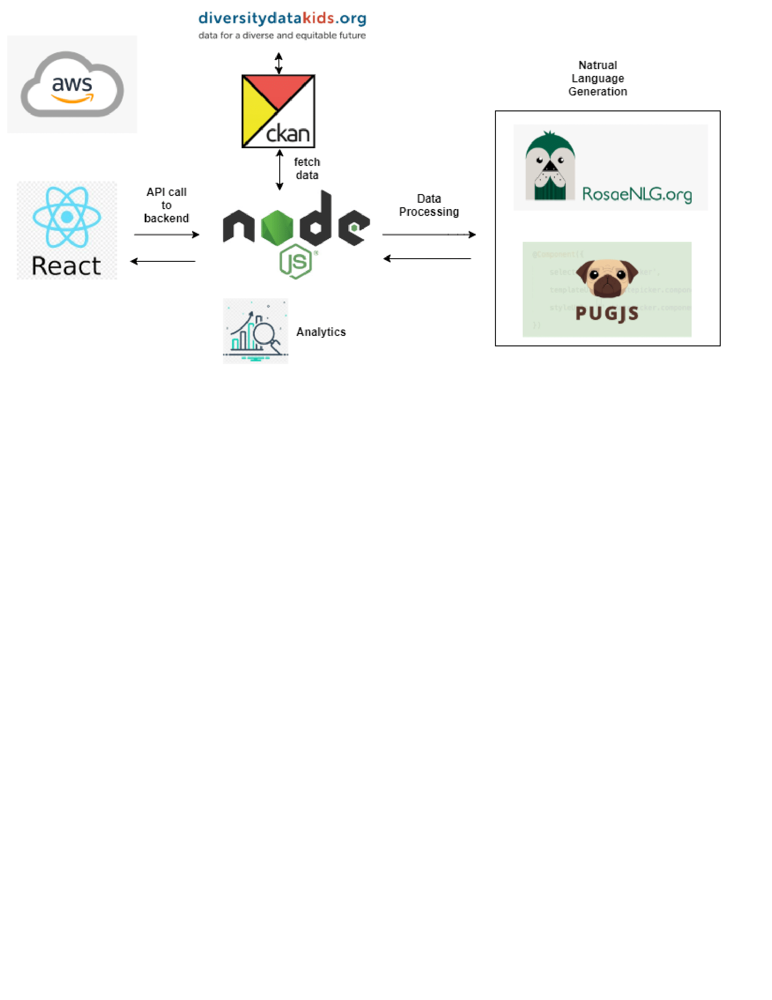

AWS Hosted Application Link
----------
http://54.242.210.205:3000/

## Citizen friendly report of diversitydatakids.org - Approved
###   Abstract: 
-    Using Divrsitykids datasets, create a dashboard and use NLG to generate a citizen friendly report.
-   About Diversitydatakids.org: It is a research project that examines who our children are, whether they have what they need to grow up healthy and achieve their full potential, whether social policies are well designed to improve children’s lives and how to make them better to improve equity. 
-   Data collected by diversitydatakids is in tabular format, which makes it difficult for a general citizen to understand the content. 
-   Our goal is to convert few topics of this tabular content to a citizen friendly report so that it becomes more readable & helps increase awareness among citizens.
###   Approach:
-   Analyse available datasets in diversitydatakids.org 
-   Pick few related topics for conversion to natural language. 
-   Import corresponding dataset from diversitydatakids.org website using Data API provided by the web page. 
-   Use NLG to transform structured numeric data to natural language like English. 
-   Create an interactive dashboard to display the generated natural language.
###   Natural Language Generation(NLG):
-   Natural-language generation (NLG) is a software process that transforms structured data into natural language.
-   reference: https://rosaenlg.org/rosaenlg/1.10.1/tutorials/tutorial_en_US.html
-   Need to go through various materials to learn & make use of NLG.
###   Datasets:
-   link: https://data.diversitydatakids.org/dataset
-   Diversitydatakids.org contains datasets of over 320 socio-economic and policy indicators capturing a wide range of topics.
###   Project Architecture :

